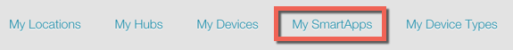
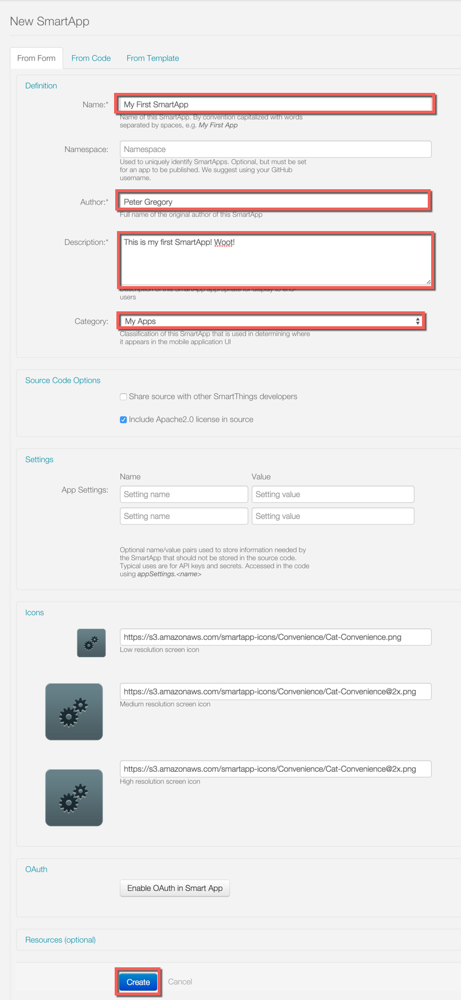
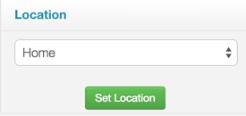
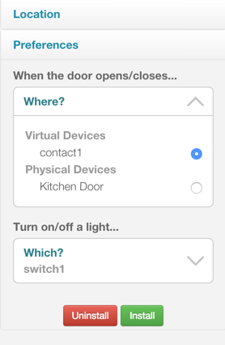
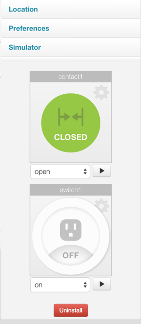
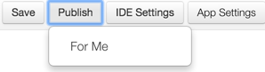

Introducción
============

Este tutorial está pensado para que pueda empezar a funcionar con la plataforma de desarrollo SmartThings - le guiaremos a través de la instalación de su propio SmartApp.

Groovy SmartApps son programas basados en que permiten a los usuarios aprovechar las capacidades de sus aparatos para automatizar sus vidas. Piensa en ellos como de la inteligencia entre nuestros dispositivos físicos.

Lo que necesita
---------------

- SmartThings un cubo que se ha configurado. Algunos dispositivos sería bueno también, pero no es necesario.
- Experiencia con alguna forma de programación. SmartThings utiliza el lenguaje de programación `Groovy <http://www.groovy-lang.org/>`__.  Lo mejor es que no necesitas ser un Ninja, pero cierta familiaridad con la programación es asumido.

Lo que vamos a construir
------------------------

Vamos a construir una SmartApp que enciende una luz cuando se abre la puerta.

Aquí está la receta para nuestra aplicación: * cuando se abre la puerta, encender una luz. Cuando se cierra la puerta, encender la luz apagado. *

vamos a construir.

Tutorial
--------

Paso 1: Registrar una cuenta de desarrollador
~~~~~~~~~~~~~~~~~~~~~~~~~~~~~~~~~~~~~~~~~~~~~

Si no lo ha hecho aún, `Registrarse en una cuenta de desarrollador <https://graph.api.smartthings.com/register/developer>`__

----

Paso 2: Ir a la página de entorno para desarrolladores
~~~~~~~~~~~~~~~~~~~~~~~~~~~~~~~~~~~~~~~~~~~~~~~~~~~~~~

Dirígete a la página `entorno de desarrollo <https://graph.api.smartthings.com>`__.  Este es el lugar donde puede administrar sus hubs, dispositivos, ver registro y más. Vamos a usar la web para crear un IDE SmartApp.

----

Paso 3: Crear su SmartApp
~~~~~~~~~~~~~~~~~~~~~~~~~

Haga clic en el botón "My SmartApps" enlace:

Esto lo llevará a la página SmartApps, donde puede ver y administrar sus SmartApps. Presione el "Nuevo SmartApp" El botón a la derecha de la página:

Dar a su aplicación un nombre, el autor y la descripción. Defina la categoría de "Mis aplicaciones".  A continuación, haga clic en el botón "Crear".

Esto le llevará a la IDE, donde podrá ver los código ha sido completada.

Hay tres métodos principales que se deben definir para SmartApps:

- "Preferencias" es donde podemos configurar la información que necesitamos de el usuario para ejecutar esta aplicación.
- "Instalado" es el método que se llama cuando esta aplicación está instalada. Normalmente, este es el lugar donde nos adherimos a los eventos de dispositivos configurados.
- "Actualizada" es el método que se llama cuando las preferencias se actualizan. Normalmente, sólo ha cancelado su suscripción y se adhiere a los acontecimientos, ya que los han cambiado sus preferencias.

Nuestro ejemplo va a ser bastante simple, vamos a crear una aplicación que activa la luz cuando se abre la puerta.

En un nivel alto, nuestra aplicación, necesitará:

#.  Reunir los dispositivos (puerta y luz) a utilizar para esta aplicación
#.  Vigilar la puerta dispositivos - si está abierto, encender la luz. Si está cerrado, lo apaga.

----

Paso 4: Rellenar el bloque preferencias
~~~~~~~~~~~~~~~~~~~~~~~~~~~~~~~~~~~~~~~

Lo primero que tenemos que hacer es reunir los sensores e interruptores queremos que este SmartApp con el que trabajar. Esto lo hacemos a través de la "preferencias" definición.

En el IDE, sustituir el bloque genera preferencias con los siguientes:

.. code-block:: groovy

    preferences {
        // What door should this app be configured for?
        section ("When the door opens/closes...") {
            input "contact1", "capability.contactSensor",
                  title: "Where?"
        }
        // What light should this app be configured for?
        section ("Turn on/off a light...") {
            input "switch1", "capability.switch"
        }
    }

Haga clic en el botón "Guardar" por encima del editor.

.. note::

    Al interactuar con los dispositivos, SmartApps debe utilizar las funciones para garantizar la máxima flexibilidad (que es la "capacidad.contactSensor" más arriba).  La capacidad disponible se puede encontrar en el :ref: 'capabilities_taxonomy" a la página.

    Más información acerca de las preferencias puede encontrarse en la `sección de Configuración y preferencias <smartapp desarrolladores-guide/preferencias y settings.html>`__ de la `Guía del desarrollador SmartApp <smartapp desarrolladores-guide/index.html>`__.

----

Paso 5: suscribirse a eventos
~~~~~~~~~~~~~~~~~~~~~~~~~~~~~

En el IDE, tenga en cuenta que hay un vacío "inicializar" método definido para usted. Este método es llamado de "instalado" y "actualizado" métodos.

Este es el lugar donde vamos a suscribir el dispositivo(s) que desea controlar. En nuestro caso, queremos saber si la puerta se abre o se cierra.

Sustituir el "inicializar" con este método:

.. code-block:: groovy

    def initialize() {
        subscribe(contact1, "contact", contactHandler)
    }

Nota los argumentos del método subscribe. El primer argumento, "contacto1 ", corresponde al nombre de entrada en las preferencias para el sensor de contacto. Esto le dice al ejecutor SmartApp qué entrada estamos suscritos a. El segundo parámetro, "contacto", es qué valor del sensor que queremos escuchar. En este caso, usamos "contacto" para escuchar a los cambios de valor (abierto o cerrado).  El tercer parámetro, "contactHandler", es el nombre de un método que se llama cuando el sensor tiene un cambio de estado. Definamos el próximo!

(No olvide hacer clic en el botón "Guardar"!).

.. note::

    Obtener más información sobre los eventos y las suscripciones se pueden encontrar en los `acontecimientos y sección <smartapp suscripciones de los desarrolladores-guide/simple-controlador de eventos-smartapps.html> `... del `SmartApp Guía del desarrollador <smartapp desarrolladores-guide/index.html> `.

----

Paso 6: Defina el controlador de eventos
~~~~~~~~~~~~~~~~~~~~~~~~~~~~~~~~~~~~~~~~

Agregue el código siguiente en la parte inferior de su SmartApp:

.. code-block:: groovy

    // event handlers are passed the event itself
    def contactHandler(evt) {
        log.debug "$evt.value"

        // The contactSensor capability can be either "open" or "closed"
        // If it's "open", turn on the light!
        // If it's "closed" turn the light off.
        if (evt.value == "open") {
            switch1.on();
        } else if (evt.value == "closed") {
            switch1.off();
        }
    }

Haga clic en el botón "Guardar" y vamos a probarlo!

----

Paso 7: Ejecutar en el simulador
~~~~~~~~~~~~~~~~~~~~~~~~~~~~~~~~

To the right of the editor in the IDE, you should see a "Location" field:

Seleccione la ubicación de su cubo (si sólo tiene un cubo, será seleccionado por defecto), y haga clic en "Establecer la ubicación".

Ahora puede elegir algunos dispositivos si se dispone de ellos, o crear algunos dispositivos virtuales.

Una vez que hayas escogido algunos dispositivos, haga clic en "Instalar" para iniciar el simulador:

Intente cambiar el sensor de contacto de cerrado a abierto, usted debe ver el interruptor en el simulador. Si usted usa un interruptor real, debería ver la luz en realidad activar o desactivar.

También nota las declaraciones de registro en la consola de registros. El registro es muy útil para propósitos de depuración.

----

Bonus: publicar su SmartApp (sólo para usted)
~~~~~~~~~~~~~~~~~~~~~~~~~~~~~~~~~~~~~~~~~~~~~

Que hemos ejecutado nuestra aplicación en el simulador, lo cual es una gran manera de poner a prueba a la hora de desarrollar. Pero también podemos publicar nuestra app, así que podemos utilizar
en nuestro teléfono inteligente, al igual que otros SmartApps. Veamos paso a paso los pasos.

En la parte superior de la IDE, existe un "Publicar" justo al lado del botón de Guardar. Haga clic en él y, a continuación, seleccione "para mí":

Debería ver un mensaje que indica su aplicación publicado con éxito.

En el teléfono móvil, inicie la SmartThings app, e ir al mercado. Select * SmartApps * , desplácese hasta la parte inferior y pulse * Aplicaciones * . Usted debe ver a su SmartApp aquí, seleccionar, y se podrá instalar cualquier otro SmartApp!

Próximos pasos
--------------

Este tutorial ha mostrado cómo configurar una cuenta de desarrollador, utilizar el IDE para crear un simple SmartApp, utilice el simulador para probar su SmartApp y publique su SmartApp a su teléfono móvil.

Además de utilizar esta documentación, la mejor manera de aprender es por echar un vistazo al código existente y la escritura propia. En el IDE, hay varias plantillas que se pueden revisar. Estos son grandes fuentes de aprendizaje desarrollo SmartThings! De hecho, hemos construido la SmartApp basa en gran medida en (bueno, es un clon total) el "Sea la luz" SmartApp.
